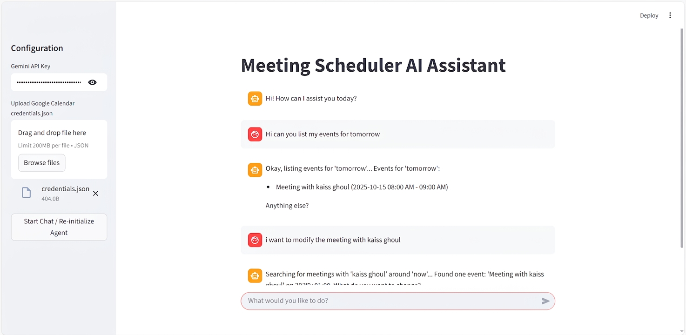

# 🗓️ Gemini-Powered Meeting Scheduler & Collaborator Manager


An intelligent AI assistant capable of interacting with users in a natural, conversational manner to manage **Google Calendar events** and maintain a list of collaborators. Powered by the **Google Gemini 2.0 Flash** model, this tool allows you to schedule, list, and modify your meetings using natural language.

---

## ✨ Features

* 💬 **Conversational Interface**: Interact with the AI using completely natural language. The agent asks clarifying questions if any crucial information is missing.
* 🧠 **Intelligent Slot Filling**: Automatically extracts key information (time, duration, names, emails) from your sentences and prompts for missing details.
* 📅 **Google Calendar Integration**: Leverages the Google Calendar API to directly schedule, list, and alter events on your personal calendar securely.
* 👥 **Collaborator Management**: Stores and retrieves collaborator details (name, email) in a local `collaborators.csv` file avoiding the need to type emails repeatedly.
* 🕒 **Dynamic Context**: The AI uses the current date and time as a baseline for understanding relative time expressions (e.g. *"Next Friday at 3pm"*).
* 🖥️ **User-Friendly UI**: A modern Streamlit web application allows for easy setup (API key, `credentials.json` upload) and provides a clean chat UI.

---

## 📸 Application Preview



---

## 🚀 Getting Started

### 1. Prerequisites
Ensure you have **Python 3.8 or higher** installed.

### 2. Installation
Install the required dependencies directly via pip:
```bash
pip install streamlit pandas dateparser google-api-python-client google-auth-httplib2 google-auth-oauthlib requests
```

### 3. Running the App
Run the Streamlit server from your terminal:
```bash
streamlit run app.py
```
The application will open automatically in your browser at `http://localhost:8501`.

---

## 🔑 Authentication Guide

To use the AI Assistant, you will need two credentials:

#### A. Gemini API Key (The Brain)
1. Visit [Google AI Studio](https://aistudio.google.com/).
2. Create an API key.
3. **Important Note:** In certain regions (like Europe), the Gemini API free tier is unavailable (`Quota Exceeded limit: 0`). You may need to enable billing (Pay-As-You-Go) in the Google Cloud Console to activate your key.

#### B. Google Calendar `credentials.json` (Your Calendar)
1. Go to the [Google Cloud Console](https://console.cloud.google.com/).
2. Create a Project and enable the **Google Calendar API**.
3. Create an **OAuth Consent Screen** (External, add yourself as a Test User).
4. Create **OAuth Client ID Credentials** (Desktop App) and download the JSON file. Rename it to `credentials.json`.

*Drag and drop your `credentials.json` and enter your Gemini API Key directly into the Streamlit sidebar to start chatting!*

---

## 👨‍💻 Author

Created and maintained by **Kaiss Ghoul**.